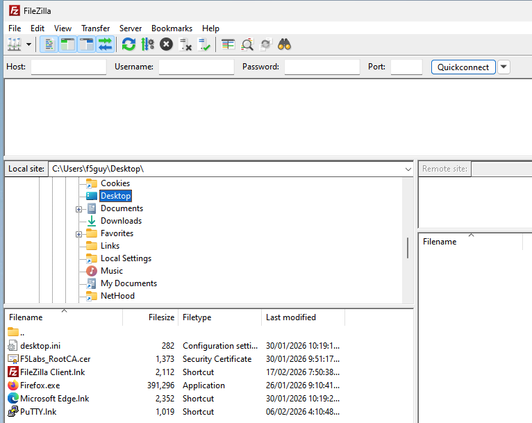
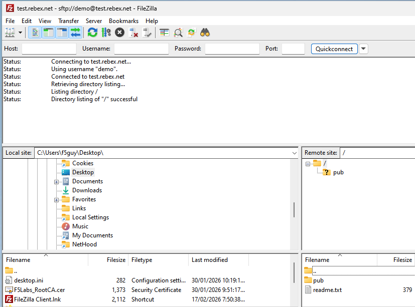
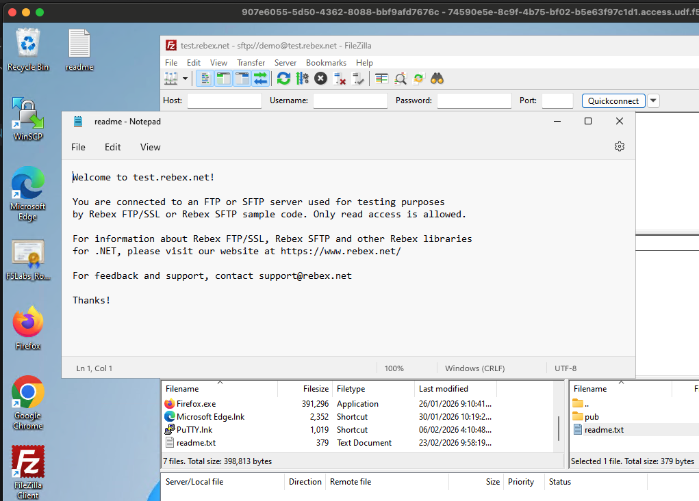
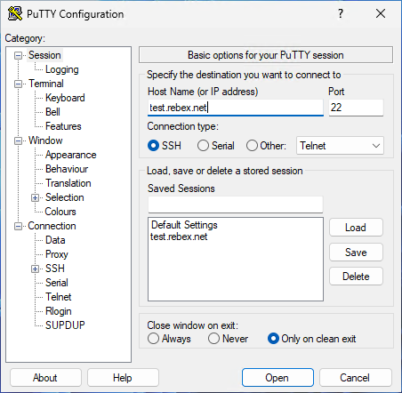

# Lab Instructions for SWG Explict Forward Proxy

## Task 1. Test browing websites

**Step 1.** Open Chrome or Firefox.

**Step 2.** Select Wikipedia bookmark in the Favorites Bar.

**Step 3.** Now open new tabs and select a differen bookmark for each site, [e.g. ESPN, Draftkings, Chatgpt, etc.) bookmark.

What is the result of browsing to each of these sites?

**Step 4.** Open Windows Settings.

**Step 5.** Search for and select Proxy and review the proxy settings by clicking the Edit button.

The F5 Explicit Forward proxy has already been configured for the browsers to use in the operating system.

**Step 6.** Turn off the 'Use a proxy server' setting. 

**Step 7.** Go back to your browser and click on the ESPN and or Draftkings bookmark again.

## Task 2. - Test SFTP client - FileZilla

**Step 1.** Open FileZilla

**Step 2.** Before connecting anywhere, select 'Desktop' under 'Local site'. The local folder now is the Desktop of this remote PC.

**Step 3.** Click the 'Site Manager' icon or Select it under File menu.

**Step 4.** Click the 'Connect' button
Watch connection and negotiation in the status pane. It should connect to the site and you should see the list of files on the right site; 'Remote site' pane.

**Step 5.** Copy over the 'Readme.txt file to the PC.  You can either Double click it or drag the file in Remote site folder to the Local site folder or to the Windows Desktop.

Open the file view it's contents.

**Step 6.** View the SOCKS Proxy settings in the FileZilla client, by selecting the Settings menu under Edit. Then choose General Proxy in the left navigation pain.

## Task 3 - Test SSH client through explicit proxy

**Step 1.** Open the PuTTY ssh client.

**Step 2.** Type the site **test.rebex.net** into the **Host Name** field and press Open

The connection will fail with a message: "Network error: Permission denied"

**Step 3.** Select test.rebex.net in the Saved Sessions section and press Open

**Step 4.** 

